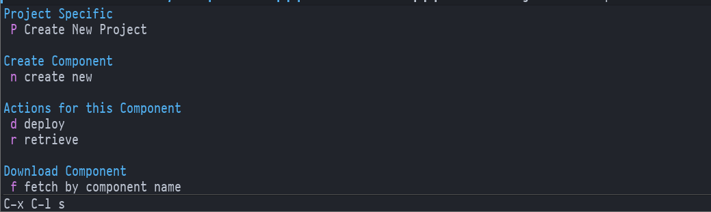

# emacs-sfdx
Emacs transient wrapper for some basic SFDX CLI commands like deploy and retrieve

## Install

### via Doom Emacs
```elisp
;; in package.el
(package! emacs-sfdx
  :recipe (:host github
           :repo "leothelocust/emacs-sfdx"
           :files ("*.el")))
           
;; in config.el
(use-package! emacs-sfdx
  :commands (sfdx/transient-action sfdx/next-component-file)
  :bind (
    ("C-x C-l s" . #'sfdx/transient-action)
    ("C-<iso-lefttab>" . #'sfdx/next-component-file)
    ))
```
### via use-package & straight
```elisp
(use-package emacs-sfdx
  :straight (
             :type git
             :host github
             :repo "leothelocust/emacs-sfdx"
             :branch "main")
  :commands (sfdx/transient-action sfdx/next-component-file)
  :bind (
    ("C-x C-l s" . #'sfdx/transient-action)
    ("C-<iso-lefttab>" . #'sfdx/next-component-file)
    ))
```

## Screenshots



